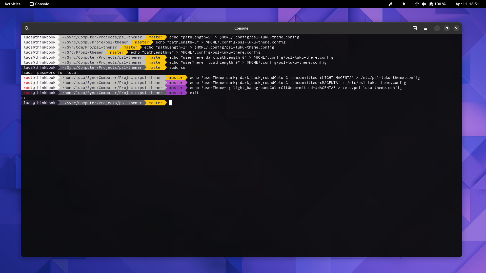

# PS1 Themer
A set of tools to easily customize Bash.

# ps1-colorize-16
*ps1-colorize-16* is a generic script that generates text ready to be inserted into your PS1 variable.

```
ps1-colorize-16

SYNOPSIS: 
	ps1-colorize-16 [FOREGROUND COLOR] [BACKGROUND COLOR] [TEXT]

DESCRIPTION:
	Prints a line colorized  with PS1 syntax.

	Syntax:
		\[\e[FOREGROUND_CODE;BACKGROUND_CODEm\] here my colored line \[\e[m\]

	Example:

		Input:
			ps1-colorize-16 39 49 " here my colored line "

		Output:
			\[\e[39;49m\] here my colored line \[\e[m\]
		
	
	This script generates 16 colors only.
	Use parameter '-h' or '--help' to show this manual.
	
	For more informations about PS1 colors: https://misc.flogisoft.com/bash/tip_colors_and_formatting

COLORS:
	
	Foreground colors:

		Default         39    Default
		Black           30    Black
		Red             31    Red
		Green           32    Green
		Yellow          33    Yellow
		Blue            34    Blue
		Magenta         35    Magenta
		Cyan            36    Cyan
		Light gray      37    Light gray
		Dark gray       90    Dark gray
		Light red       91    Light red
		Light green     92    Light green
		Light yellow    93    Light yellow
		Light blue      94    Light blue
		Light magenta   95    Light magenta
		Light cyan      96    Light cyan
		White           97    White

	Background colors:

		Default         49    Default
		Black           40    Black
		Red             41    Red
		Green           42    Green
		Yellow          43    Yellow
		Blue            44    Blue
		Magenta         45    Magenta
		Cyan            46    Cyan
		Light gray      47    Light gray
		Dark gray       100   Dark gray
		Light red       101   Light red
		Light green     102   Light green
		Light yellow    103   Light yellow
		Light blue      104   Light blue
		Light magenta   105   Light magenta
		Light cyan      106   Light cyan
		White           107   White

```


The script is invoked by the PS1 Themer package themes to customize your terminal.

# Themes
There are currently two themes available:
- **ps1-luku-theme** (main theme)
- **ps1-luku-squared-theme** (main theme variant, no Unicode symbols used)

## Luku themes features
- light and dark variants
- colorized *root* user
- different custom foreground/background colors for *username@hostname*, current directory and Git Branch name
- custom background colors for the Git Branch name if there are changes to be committed
- custom folder length for the current working directory *(used to prevent full long paths to be displayed)*
- squared theme variant for terminal which do not support Unicode symbols

An example of theme customization:

Light variant:

Dark variant:

Cygwin Bash on Windows 11 (square variant):


# How to install
You have two options:

## 1. Automatic installation
Use "install.sh" to automatically install the package. This will install the Systemd service for theme synchronization too.

## 2. Manual installation
To install a theme simply add the following code to */etc/bash.bashrc*
```console
ps1Update() { 
	PS1="$(ps1-luku-theme)"
}
PROMPT_COMMAND=ps1Update
```
replace "ps1-luku-theme" with your chosen theme.

Put "ps1-colorize-16" and your themes in a folder located in `$PATH`.

This is an example of *bash.bashrc*:
```
#!/bin/bash

ps1Update() { 
	PS1="$(ps1-luku-theme)"
	# export PROMPT_DIRTRIM=3 # Uncomment to show the last three folders in PS1 Path
}
# Variable 'PROMPT_COMMAND' is used to update PS1 at every new command
PROMPT_COMMAND=ps1Update

# Print hidden files first ('dot files')
# Print directory first
# Print file on by line
# Colorize output
alias ls="ls -a1v --group-directories-first --color=auto"
```

# Theme Synchronization Service
A Systemd service to synchronize **Libadwaita**, **GTK** and **ps1-luku** themes.
When you change theme using the "appearence" menu, GTK and ps1-luku theme will change automatically too!

This script was developed and tested for Gnome 42 and above.

The service consists of three files:
* **ps1-themer.service**: Systemd service file
* **libadwaita-theme-sync**: script started from the Systemd service file
* **libadwaita-theme-sync-writer**: script started from *libadwaita-theme-sync*. Requires SUID bit to be set

**You can install the service via install.sh** or manually. Example onfiguration below.

Copy the scripts to a folder **inside the `$PATH` variable**:
```bash
sudo cp ./libadwaita-theme-sync /foo/bar
sudo cp ./libadwaita-theme-sync-writer /foo/bar
```

Set execution permissions on the files and SUID bit on *libadwaita-theme-sync-writer* (the service needs to run as a normal user but needs to modify */etc/ps1-luku-theme.config* as root user. For this purpose *libadwaita-theme-sync-writer* with SUID is used):
```bash
cd /foo/bar
sudo chmod +x ./libadwaita-theme-sync-writer ./libadwaita-theme-sync
sudo chown root:root /libadwaita-theme-sync-writer;
sudo chmod u+s ./libadwaita-theme-sync-writer;
```
Change **GTK_THEME_DARK** and **GTK_THEME_LIGHT** inside *libadwaita-theme-sync* with a GTK3 theme you like. I recommend using https://github.com/lassekongo83/adw-gtk3 which will make GTK applications similar to those using Libadwaita! Example:
```bash
#!/bin/bash
GTK_THEME_DARK="adw-gtk3-dark"
GTK_THEME_LIGHT="adw-gtk3"

while :
do
	libadwaitaTheme=$(gsettings get org.gnome.desktop.interface color-scheme)
	if [[ "$libadwaitaTheme" == *"prefer-dark"* ]]; then
		gsettings set org.gnome.desktop.interface gtk-theme "$GTK_THEME_DARK"
		libadwaita-theme-sync-writer 1
	else
		gsettings set org.gnome.desktop.interface gtk-theme "$GTK_THEME_LIGHT"
		libadwaita-theme-sync-writer 0
	fi
	sleep 1
done
```

Now copy and enable the service file. I recommend doing a "per-user" configuration:
```bash
cp ./ps1-themer.service ~/.config/systemd/user;
systemctl --user enable ps1-themer;
```

